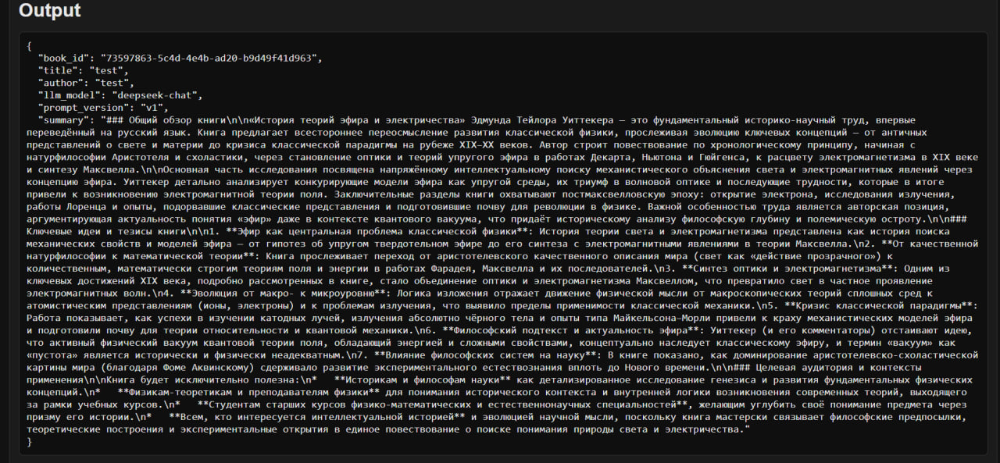
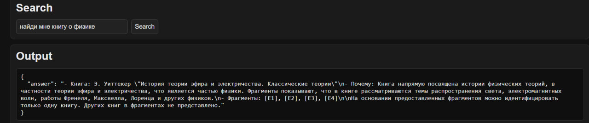
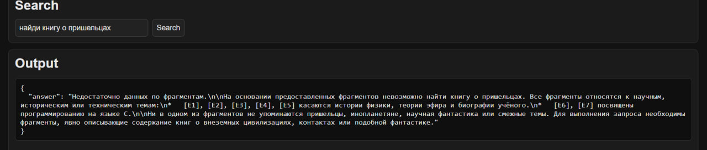

# aibooks

`aibooks` — backend-сервис для работы с PDF-книгами со следующим функционалом:

- загрузка книг;
- OCR распознавание текста;
- векторизация распознанного текста;
- семантический поиск по библиотеке;
- генерация кратких содержаний книг через LLM

Проект написан на Go и построен как асинхронный пайплан: тяжёлые этапы выполняются воркером через очередь, а HTTP-сервер отдаёт API и принимает пользовательские запросы.

---

## Содержание

- [Что делает проект](#что-делает-проект)
- [Примеры работы проекта](#примеры-работы-проекта)
- [Архитектура](#архитектура)
- [Технологии](#технологический-стэк)
- [Запуск](#быстрый-запуск-через-docker)
- [HTTP API](#http-api)
- [Переменные окружения](#переменные-окружения)
- [Task-команды](#task-команды)
- [Структура репозитория](#структура-репозитория)
- [Наблюдаемость и логи](#наблюдаемость-и-логи)

---

## Что делает проект

Основной функционал:

1. Пользователь загружает PDF через `POST /books/upload`.
2. Сервер ставит задачу `ocr:book` в asynq.
3. Воркер:
   - конвертирует PDF-страницы в изображения (`pdftoppm`);
   - запускает OCR (`tesseract`);
   - пишет текст в БД (`ocr_pages`).
4. Затем воркер запускает `index:book`:
   - делит текст на чанки;
   - получает эмбеддинги;
   - сохраняет полученные векторы в БД (pgvector).
5. Затем `summarize:book`:
   - при помощи LLM осуществляется создание краткого содержания книги;
   - сохраняет полученный текст в БД.
6. Пользователь делает `POST /search` и получает ответ LLM на основе релевантных фрагментов.

Важно: пока шаги index/summarize не завершились, `GET /books/{bookID}/summary` может вернуть `404`, это ожидаемое поведение.

---

---

## Примеры работы проекта

### Пример краткого содержания книги:



### Пример успешного поиска:



### Пример безуспешного поиска:



---


## Архитектура

Компоненты:

- `aibooks-server` — HTTP API, auth, enqueue задач.
- `aibooks-worker` — фоновые job handlers (`ocr:book`, `index:book`, `summarize:book`).
- PostgreSQL + pgvector — хранение книг, OCR-текста, чанков, эмбеддингов, саммари.
- Redis — очередь Asynq.
- Kafka — транспорт логов.

Поток данных:

`client -> server -> redis(asynq) -> worker -> postgres/pgvector -> server -> client`

---

## Технологический стэк

- Go 1.26
- HTTP: `chi`, `cors`, middleware
- Queue: `hibiken/asynq`
- DB: `pgx`, PostgreSQL, pgvector
- OCR: `poppler-utils`, `tesseract-ocr`
- Embeddings: GigaChat
- LLM: DeepSeek
- Logging: stdout + файл + опционально Kafka
- Прочее: Docker Compose, Taskfile

---

## Быстрый запуск через Docker

### 1) Подготовить `.env`

```bash
cp .env.example .env
```

Заполнить минимум:

- `AIBOOKS_DB_URL`
- `AIBOOKS_AUTH_SECRET`
- `AIBOOKS_GIGACHAT_AUTH_KEY`
- `AIBOOKS_DEEPSEEK_API_KEY`

### 2) Поднять инфраструктуру и применить миграции

```bash
task bootstrap
```

### 3) Поднять server + worker

```bash
task app:up
```

### 4) Проверить health

```bash
task app:health
```

### 5) Смотреть логи

```bash
task app:logs
```

### 6) Поднять фронтенд

```bash
task app:web
```


## HTTP API

### Публичные

- `GET /healthz`
- `POST /auth/register`
- `POST /auth/login`

### Приватные

- `GET /books`
- `POST /books/upload` (multipart: `file`, `title`, `author`)
- `POST /search`
- `GET /books/{bookID}/summary`
- `DELETE /books/{bookID}`

### Rate limiting:

- общий лимит API;
- отдельный (более строгий) для `/auth/*`.

настраивается через `AIBOOKS_HTTP_RATE_LIMIT_*` и `AIBOOKS_HTTP_AUTH_RATE_LIMIT_*`.

---

## Переменные окружения

Ключевые:

- `AIBOOKS_DB_URL` — PostgreSQL DSN
- `AIBOOKS_REDIS_ADDR`, `AIBOOKS_REDIS_DB`
- `AIBOOKS_AUTH_SECRET`
- `AIBOOKS_OCR_LANG`, `AIBOOKS_PDF_DPI`
- `AIBOOKS_EMBEDDING_PROVIDER` (по умолчанию `gigachat`)
- `AIBOOKS_GIGACHAT_AUTH_KEY`
- `AIBOOKS_LLM_PROVIDER` (по умолчанию `deepseek`)
- `AIBOOKS_DEEPSEEK_API_KEY`
- `AIBOOKS_LOG_DIR`
- `AIBOOKS_LOG_KAFKA_BROKERS`, `AIBOOKS_LOG_KAFKA_TOPIC`

---

## Task-команды

```bash
task              
task bootstrap    
task infra:up     
task infra:down
task infra:reset  
task db:migrate
task db:rollback
task app:up  
task app:down
task app:logs
task app:server   
task app:worker
task app:test
task app:build
```

---

## Структура репозитория

```text
cmd/
  aibooks-server/      # HTTP REST API
  aibooks-worker/      # Asynq worker

internal/
  auth/                # JWT-токены и middleware
  handlers/            # HTTP хэндлеры
  jobs/                # Asynq хэндлеры
  ingest/              # пайплайн распознавания текста
  chunking/            # разделение на чанки
  index/               # пайплайн эмбеддинга
  search/              # семантический поиск + генерация LLM ответа
  summarize/           # пайплайн суммаризации текста
  db/                  # работа с базой данных
  providers/           # работа с GigaChat API и Deepseek API
  ocr/                 # распознавание текста
  logging/             # логирование (в т.ч. через Kafka)
  config/              # загрузка и валидация переменных окружения

migrations/            # миграции
web/                   # простой фронтенд для локальных проверок
```

---

## Наблюдаемость и логи

Логи пишутся в:

- stdout
- файл в `AIBOOKS_LOG_DIR`
- Kafka (если заданы брокеры)

Топик для Kafka: `AIBOOKS_LOG_KAFKA_TOPIC` (по умолчанию `aibooks.logs`).

---